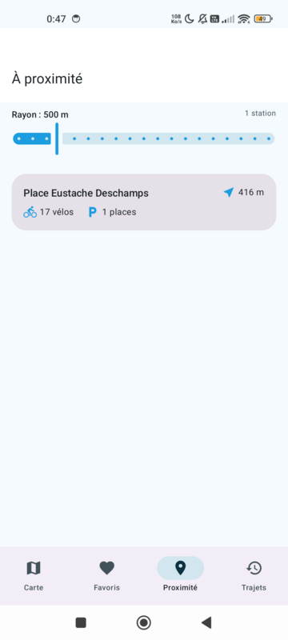

# Vélib' Android

Application Android (Kotlin / Jetpack Compose) pour visualiser les stations **Vélib' Métropole** en temps réel : carte interactive, détail des stations, favoris consultables hors connexion, et recherche des stations les plus proches dans un rayon paramétrable.

Projet réalisé en solo dans le cadre du cursus EPF (SNI2).

---

## Fonctionnalités

### Principales
- **Carte interactive** : toutes les stations affichées avec des marqueurs colorés selon la disponibilité (vert = vélos dispo, orange = dépôt seulement, rouge = hors service). Les marqueurs deviennent de simples points quand on dézoome.
- **Détail d'une station** : nombre de vélos (mécaniques / électriques), places libres, capacité, statut, dernière mise à jour.
- **Favoris hors connexion** : marquer des stations d'un cœur ; la liste et les données restent consultables **sans réseau** (avec la date de la dernière synchro).
- **Stations à proximité** : géolocalisation + **rayon réglable** (200 m → 2 km), stations triées par distance.

### Bonus
- **Recherche** d'une station par nom sur la carte (tolérante aux accents).
- **Itinéraire** : bouton qui ouvre Google Maps / l'app de cartographie vers la station.
- **Historique des trajets** : saisie manuelle (départ → arrivée + date) avec statistiques (km cumulés, station la plus utilisée).
- **Rafraîchissement automatique en arrière-plan** (WorkManager) : les données des favoris sont mises à jour périodiquement pour rester fraîches hors ligne.

### Expérience utilisateur
- Thème **Material 3** aux couleurs Vélib' (blanc / bleu / vert), coins arrondis, touche de glassmorphisme, **mode clair et sombre**.
- États de chargement / erreur / vide soignés.
- **Pull-to-refresh** (proximité, favoris), bouton **« me localiser »** sur la carte.
- Transitions animées entre les écrans.

---

## Pile technique

| Couche | Choix |
|---|---|
| Langage | Kotlin |
| UI | Jetpack Compose + Material 3 |
| Carte | osmdroid (OpenStreetMap, sans clé API) |
| Réseau | Retrofit + OkHttp + kotlinx.serialization |
| Persistance | Room |
| Injection de dépendances | Hilt |
| Tâches de fond | WorkManager |
| Géolocalisation | FusedLocationProviderClient (Play Services Location) |
| Architecture | MVVM + Repository |

**Source de données** : [API GBFS Vélib' Métropole](https://www.velib-metropole.fr/donnees-open-data-gbfs-du-service-velib-metropole) — gratuite, sans clé. Flux `station_information.json` (statique) + `station_status.json` (temps réel).

---

## Installation

### Prérequis
- Android Studio (Ladybug ou plus récent)
- Un appareil ou émulateur Android **8.0+ (API 26)**

### Lancer le projet
```bash
git clone <url-du-repo>
cd Velib_android
./gradlew installDebug      # compile et installe sur l'appareil branché
```

Ou ouvrir le dossier dans Android Studio et cliquer sur **Run**.

Pour générer simplement l'APK :
```bash
./gradlew assembleDebug
# APK : app/build/outputs/apk/debug/app-debug.apk
```

> L'application demande l'autorisation de **localisation** au premier lancement (pour la carte et l'écran proximité). Elle fonctionne sans, mais sans position utilisateur ni stations proches.

---

## Utilisation

1. **Carte** — explore les stations, touche un marqueur pour ouvrir le détail, ou cherche une station par son nom. Boutons en bas à droite : rafraîchir et recentrer sur ta position.
2. **Favoris** — retrouve tes stations enregistrées, même hors connexion. Tire vers le bas pour rafraîchir les données.
3. **Proximité** — règle le rayon avec le curseur pour voir les stations autour de toi, triées par distance.
4. **Trajets** — note tes déplacements (bouton +) et suis tes statistiques.

---

## Captures



*Écran « À proximité » — thème clair Vélib'.*

---

## Structure du projet

```
app/src/main/java/fr/epf/sni2/velib_android/
├── data/
│   ├── local/        # Room (entités, DAO, base)
│   ├── location/     # fournisseur de position
│   ├── remote/       # API GBFS (Retrofit) + DTO
│   └── repository/   # StationRepository, FavoriteRepository, TripRepository
├── di/               # modules Hilt (réseau, base de données)
├── domain/model/     # modèles métier (Station, Trip, FavoriteStation)
├── ui/
│   ├── navigation/   # routes
│   ├── screens/      # carte, détail, favoris, proximité, historique
│   └── theme/        # couleurs, formes, glassmorphisme
└── work/             # WorkManager (rafraîchissement des favoris)
```
